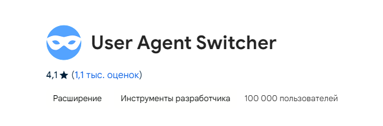
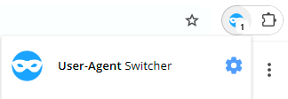
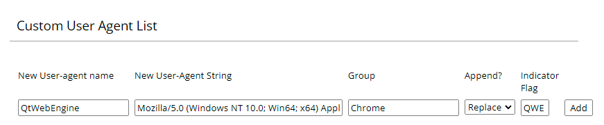

# AuroHack
Расширения для браузера Chrome, которое позволяет осуществлять вставку в АСО "Аврора".

## Требования
- Браузер Chrome

## Настройка расширения
1) Скачайте [актуальную](https://github.com/liner-exe/AuroHack/releases/latest) версию расширения (AuroHack.zip).
2) Распакуйте расширение в удобное вам место.
3) Зайдите в меню "расширения" браузера и включите режим разработчика:<br>
4) Загрузите раннее распакованное расширение:<br>
5) Скачайте [User Agent Switcher](https://chromewebstore.google.com/detail/user-agent-switcher/kchfmpdcejfkipopnolndinkeoipnoia) (далее - UAS):<br>
6) Зайдите в настройки UAS:<br>
7) Добавьте новый User Agent:<br><br>```Mozilla/5.0 (Windows NT 10.0; Win64; x64) AppleWebKit/537.36 (KHTML, like Gecko) QtWebEngine/5.15.2 Chrome/80.0.3987.163 Safari/537.36```
8) Всё готово. Можете заходить на [АСО "Аврора"](https://mirea.aco-avrora.ru/student/).

### Q&A
- Q: Зачем нужен UAS?
- A: UAS нужен т.к сайт, по-видимому, ожидает, что мы зайдём именно с QtWebEngine, а не с браузера напрямую.

### Плюсы подобного способа
- Не нужно устанавливать приложение АСО "Аврора" на свой ПК.
- Разрешается вставка откуда угодно.

### Минусы подобного способа
- Не слишком простая установка.
- Нужно скачивать доп. расширение.
- Сохранение входа на АСО "Аврора" через браузер не предусмотрено. Это означает, что при перезаходе на сайт, ваш вход сбросится и нужно будет логиниться по-новой. 
